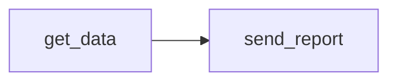
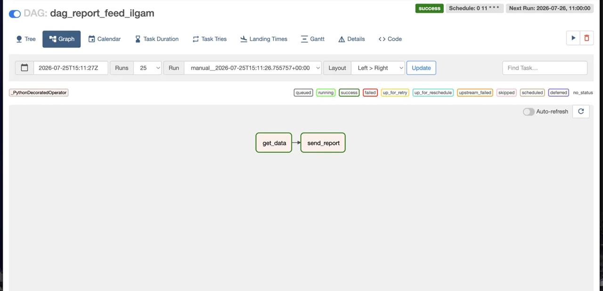
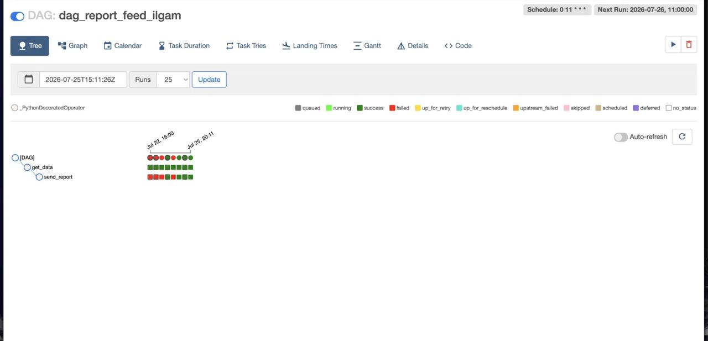
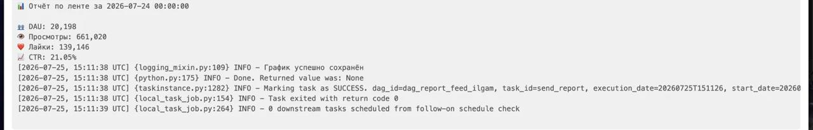
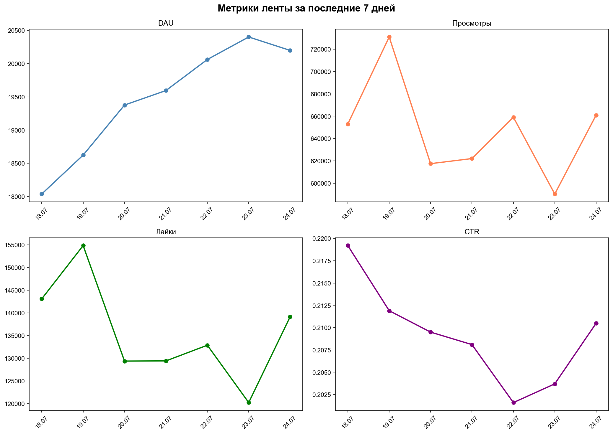
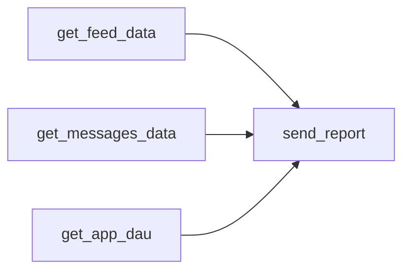
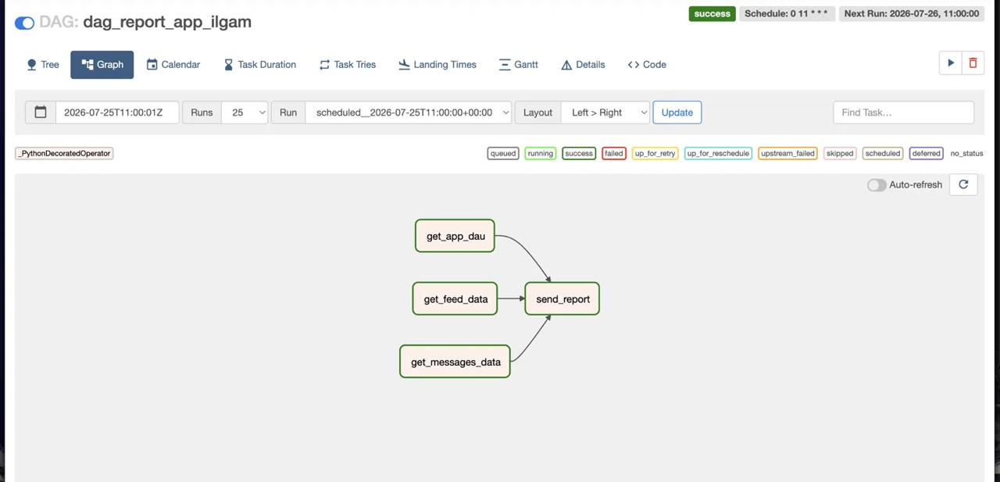
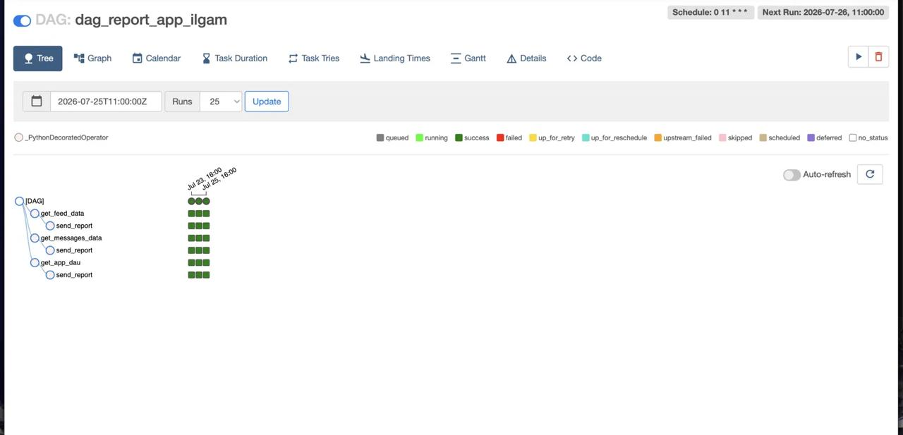
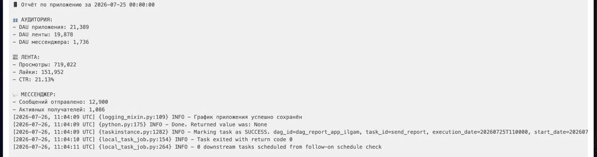
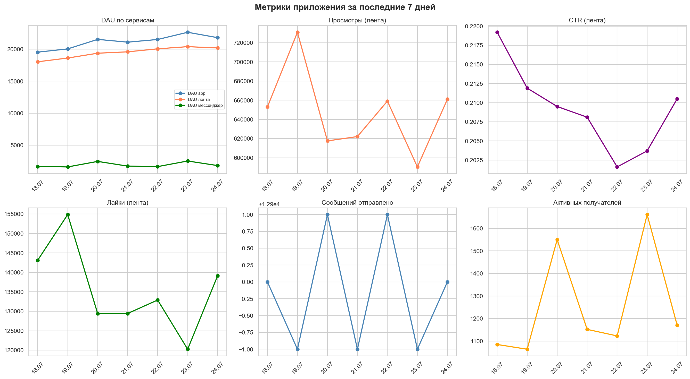

# 📊 Airflow Reports Automation

## Описание

Автоматизированная система ежедневной отчётности
на Apache Airflow. Два DAG отправляют отчёты
каждое утро в 11:00 UTC с ключевыми метриками
продукта.

---

## DAG 1 — Отчёт по ленте

**Метрики:** DAU, просмотры, лайки, CTR

**Архитектура:**



### Граф DAG


### История запусков


### Пример отчёта в логах Airflow


### График метрик за 7 дней


---

## DAG 2 — Отчёт по приложению

**Метрики:**
- Аудитория: DAU приложения / ленты / мессенджера
- Лента: просмотры, лайки, CTR
- Мессенджер: сообщений отправлено, активных получателей

**Архитектура:**



Три таска выполняются параллельно →
объединяются в send_report

### Граф DAG


### История запусков


### Пример отчёта в логах Airflow


### График метрик за 7 дней


---

## Пример отчёта по ленте

```
📊 Отчёт по ленте за 2026-07-24

👥 DAU: 20,198
👁 Просмотры: 661,020
❤️ Лайки: 139,146
📈 CTR: 21.05%
```

---

## Пример отчёта по приложению

```
📱 Отчёт по приложению за 2026-07-25

👥 АУДИТОРИЯ:
- DAU приложения: 21,389
- DAU ленты: 19,878
- DAU мессенджера: 1,736

📰 ЛЕНТА:
- Просмотры: 719,022
- Лайки: 151,952
- CTR: 21.13%

💬 МЕССЕНДЖЕР:
- Сообщений отправлено: 12,900
- Активных получателей: 1,086
```

---

## Примечание

Отчёт разработан для отправки в Telegram бот.
В окружении симулятора Карпова внешние
подключения заблокированы — результаты
выводятся в логи Airflow через print().

Для запуска в продакшн окружении достаточно
раскомментировать блок с telegram.Bot
и указать токен.

---

## Стек

Python (pandas, matplotlib, seaborn, pandahouse),
Apache Airflow, ClickHouse, SQL

---

## Структура репозитория

```
airflow-reports-automation/
├── README.md
├── dag/
│   ├── report_feed.py
│   └── report_app.py
└── screenshots/
    ├── dag_feed_graph.jpg
    ├── dag_feed_tree.jpg
    ├── dag_app_graph.jpg
    ├── dag_app_tree.jpg
    ├── logs_feed.jpg
    ├── logs_app.jpg
    ├── report_feed.png
    └── report_app.png
```
